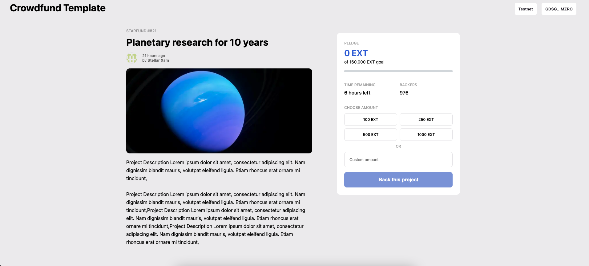

# Soroban Crowdfunding Dapp Example



This is a [Next.js](https://nextjs.org/) project, demoing how to build a dapp frontend
backed by smart contracts on Stellar.

## Getting Started

### Dependencies

1. Install the soroban-cli from https://soroban.stellar.org/docs/getting-started/setup#install-the-soroban-cli
2. Install Docker for Standalone and Futurenet backends.
3. Node.js v17

### Backend (Local Sandbox)

1. Run the backend with `soroban-cli serve`
2. Run `./initialize.sh sandbox` to load the contracts and initialize it.
  - Note: this will create a `.soroban` sub-directory, to contain the sandbox
    network data.
3. Configure Freighter
  a. Install the custom Freighter Soroban release from https://github.com/stellar/freighter/releases/tag/v2.6.0-beta.2
  b. Enable "Experimental Mode" in the settings (gear icon).
  c. Add a custom network:
    |   |   |
    |---|---|
    | Name | Sandbox |
    | URL | http://localhost:8000/soroban/rpc |
    | Passphrase | Local Sandbox Stellar Network ; September 2022 |
    | Allow HTTP connection | Enabled |
    | Switch to this network | Enabled |

### Backend (Local Standalone Network)

1. Run the backend docker container with `./quickstart.sh standalone`, and wait for it to start.
2. Run `./initialize.sh standalone` to load the contracts and initialize it.
  - Note: this state will be lost if the quickstart docker container is removed.
3. Configure Freighter
  a. Install the custom Freighter Soroban release from https://github.com/stellar/freighter/releases/tag/v2.6.0-beta.2
  b. Enable "Experimental Mode" in the settings (gear icon).
  c. Add a custom network:
    |   |   |
    |---|---|
    | Name | Standalone |
    | URL | http://localhost:8000/soroban/rpc |
    | Passphrase | Standalone Network ; February 2017 |
    | Allow HTTP connection | Enabled |
    | Switch to this network | Enabled |
4. Add some Standalone network lumens to your Freighter wallet.
  a. Copy the address for your freighter wallet.
  b. Visit `http://localhost:8000/friendbot?addr=<your address>`

### Backend (Futurenet)

1. Run the backend docker container with `./quickstart.sh futurenet`, and wait for it to start.
  - Note: This can take up to 5 minutes to start syncing. You can tell it is
    working by visiting http://localhost:8000/, and look at the
    `ingest_latest_ledger`, field. If it is `0`, the quickstart image is not
    ready yet.
2. Run `./initialize.sh futurenet` to load the contracts and initialize it.
3. Configure Freighter
  a. Install the custom Freighter Soroban release from https://github.com/stellar/freighter/releases/tag/v2.6.0-beta.2
  b. Enable "Experimental Mode" in the settings (gear icon).
  c. Add a custom network (Note, the out-of-the-box "Future Net" network in
  Freighter will not work with a local quickstart container, so we need to add
  our own):
    |   |   |
    |---|---|
    | Name | Futurenet |
    | URL | http://localhost:8000/soroban/rpc |
    | Passphrase | Test SDF Future Network ; October 2022 |
    | Allow HTTP connection | Enabled |
    | Switch to this network | Enabled |
4. Add some Futurenet network lumens to your Freighter wallet.
  - Visit https://laboratory.stellar.org/#create-account, and follow
    the instructions to create your freighter account on Futurenet.

### Frontend

Then, run the development server:

```bash
npm run dev
```

Open [http://localhost:3000](http://localhost:3000) with your browser to see the result.

Note: Before you can "Approve transfer & Back this project", you'll need to have
some EXT (example token) in your freighter wallet. There is a "Mint 100 EXT"
button, which will gift you 100 EXT tokens for that purpose.

## User Workflows

The contract dev should be able to:

- Clone the example repo (this one)
- Choose their target amount and deadline
- Deploy their contract to futurenet
- Deploy a soroban rpc server somewhere (TBD)
- Deploy the example web ui somewhere (e.g. netlify)

Then via the web UI, users should be able to:

- Connect their wallet (freighter for now)
- See their current balance(s)
- See the current fundraising status (total amount & time remaining)
- See allowed assets (xlm-only for now?)
- Deposit an allowed asset
- See their deposit(s) appear on the page as the transactions are confirmed.
- "Live"-Update the page with the total amount with the new amount

## Wallet Integration & Data Fetching

There is a `./wallet` directory, which contains a small library to connect to
the user's freighter wallet, as well as some React hooks to talk to a
soroban-rpc server (e.g. `soroban-cli serve`), to fetch data and send
transactions.

Data from contracts is fetched using the `useContractValue` hook in
`./wallet/hooks/useContractValue.tsx`. Transactions are submitted to the network
using the `useSendTransactions` hook in `./wallet/hooks/useSendTransaction.tsx`.
